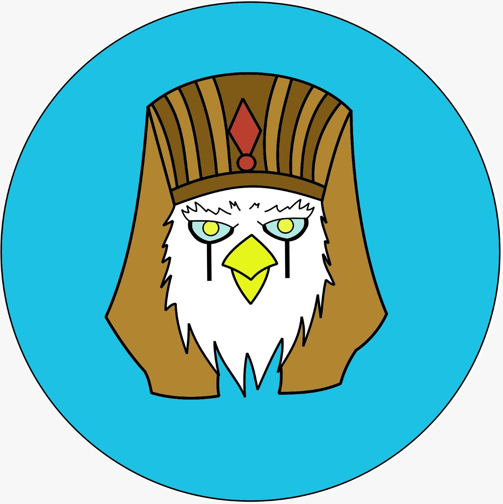
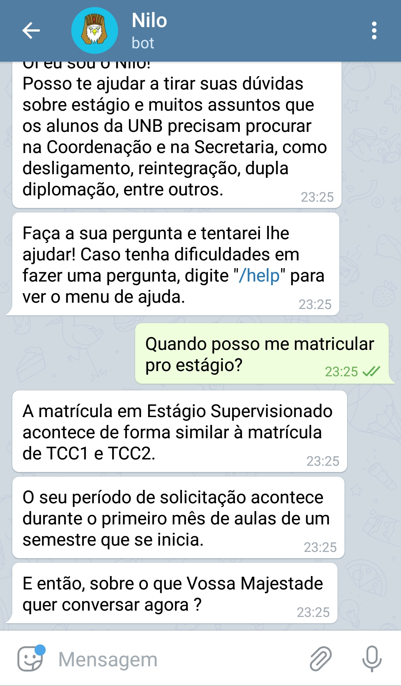
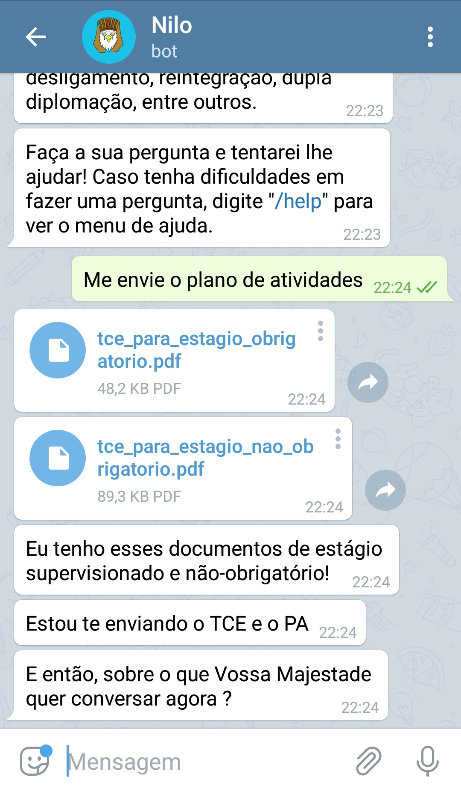

# Chatbot Nilo

<p align="center" >
	
	<br/>
	<h1> Chatbot Nilo</h1>
	</p>

## Sobre o projeto

O Chatbot Nilo é o seu guia no grande deserto chamado FGA…
Tem dúvidas sobre algo na Universidade? Estágio supervisionado, menções, monitoria, etc. O Nilo pode te ajudar!
Criado a partir do Rasa-boilerplate [1] e desenvolvido na matéria de MDS [2].

## 🔨 Como utilizar?

Basta que você tenha o Telegram instalado no seu computador ou celular e
então procure o bot pelo nome “@nilo_fga_bot” e caso ele esteja upado, será possível iniciar uma conversa.

<p align="center" >
	
	<br/>
	</p>

## ✨ Features

Os assuntos que o Nilo já conhece são:

- Estágio supervisionado
- Estágio não-obrigatório
- Desligamento e seu risco
- Reintegração
- Revisão de menção

<br/>

## ✨ Protótipo

<br/>

<p align="left" >
	
	
	</p>
<br/>

## 📦 Instalação

**Clonando o repositório**


    $ git clone https://github.com/fga-eps-mds/2019.2-Chatbot-Nilo.git

    $ cd 2019.2-Chatbot-Nilo

## Como subir o seu bot para telegram

### 1. Crie um bot no Telegram

Basta iniciar uma conversa com o [@BotFather do Telegram](https://t.me/BotFather) e digitar o comando “/newbot”, após isso é só seguir as instruções e você terá criado seu bot.

### 2. Coloque no código as informações do seu bot

Após escolher o nome do seu bot você receberá um token do @BotFather, com esse token será possível acessar a API do telegram.

Adicione o nome do seu bot e o token no [arquivo de configuração](docker/bot-telegram.env)

    sh
    TELEGRAM_BOT_USERNAME=username_do_bot
    TELEGRAM_TOKEN=token_fornecido_pelo_BotFather


### 3. Execute o ngrok

Após a etapa anterior, é necessário utilizar o [ngrok](https://ngrok.com/download), O Ngrok é um programa de linha de comando que permite criar um túnel de conexão segura a partir do seu localhost e publicá-lo na internet. Ele é multiplataforma, podendo ser usado no Windows, Linux e Mac OS X.

Conforme a seguir, execute o ngrok na porta 5001.

```sh
./ngrok http 5001
```

**Atenção:** O conector do Telegram está utilizando a porta 5001 como padrão. Caso queira mudar, somente altere
a porta utilizada pelo [Makefile](bot/Makefile).


### 4. Exporte a URL do Webhook

Enquanto o ngrok estiver em execução, ele apresentará uma série de informações da sessão atual. Copie a url do campo Forwarding com o protocolo HTTPS e cole no [arquivo de configurações do bot](../docker/bot-telegram.env). ela será similar à seguinte.

```sh
TELEGRAM_WEBHOOK=link_do_ngrok/webhooks/telegram/webhook
```

**Lembre-se!** sempre que executar o ngrok essa url deve ser exportada.


## 5. Execução do bot no telegram

Ao final de realizar essas configurações, seu [arquivo de configurações do bot](docker/bot-telegram.env) deve estar de acordo com o exibido logo abaixo:

```sh
TELEGRAM_BOT_USERNAME=lappisbot
TELEGRAM_TOKEN=token
TELEGRAM_WEBHOOK=your_webhook_server/webhooks/telegram/webhook
```

**Antes de seguir adiante. Importante:** 

As variáveis de ambiente são necessárias para o correto funcionamento do bot, por isso não esqueça de exportá-las.

Se ainda não tiver treinado seu bot execute antes:

```sh
make train
```
**Atenção**: o comando "make train" executa um container docker, caso precise de sudo em seu computador
para execução docker, utilize "sudo make train".  


Depois execute o bot no telegram:

```sh
sudo docker-compose up bot_telegram
```

## 🤝 Como contribuir

Gostaria de contribuir com nosso projeto? É simples! Basta ler e acompanhar nosso [Guia de Contribuição](./CONTRIBUTING.md) presente em nosso repositório.

Todos que desejam contribuir de alguma forma com nosso projeto são mais que bem-vindos, e todos da equipe do Nilo agradecem a sua contribuição.
