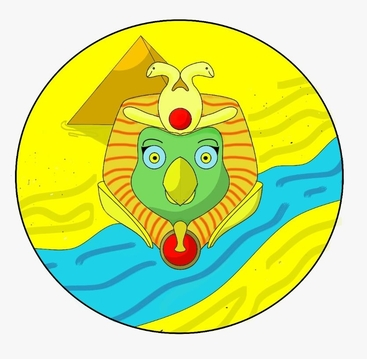

# Chatbot Nilo

	
	 
	

# O que é o Nilo?

O Chatbot Nilo é o seu guia no grande deserto chamado FGA…
Tem dúvidas sobre algo na Universidade? Estágio supervisionado, menções, monitoria, etc. O Nilo pode te ajudar!
Criado a partir do Rasa-boilerplate [1] e desenvolvido na matéria de MDS [2].

# Como utilizar?

Basta que você tenha o Telegram instalado no seu computador ou celular e
então procure o bot pelo nome “@nilo_fga_bot” para poder começar a conversar.

# O que ele pode fazer?

Os assuntos que o Nilo já conhece são:

- Estágio supervisionado
- Estágio não-obrigatório
- Desligamento e seu risco
- Reintegração
- Revisão de menção

# Documentação:
- [1. Documento de Arquitetura](
 https://github.com/fga-eps-mds/2019.2-Chatbot-Nilo/blob/develop/docs/DocumentoDeArquitetura.md) 
- [2. Documento de Visão](https://github.com/fga-eps-mds/2019.2-Chatbot-Nilo/blob/develop/docs/DocumentoDeVisao.md)
- [3. TAP](https://github.com/fga-eps-mds/2019.2-Chatbot-Nilo/blob/develop/docs/TAP.md)
- [4. Roadmap](https://github.com/fga-eps-mds/2019.2-Chatbot-Nilo/blob/develop/docs/Roadmap.md)
- [5. Escopo](https://github.com/fga-eps-mds/2019.2-Chatbot-Nilo/blob/develop/docs/Escopo.md)

# Discussão de Sugestões
Caso tenha qualquer dúvida, sugestão ou queira reportar algum bug sobre nosso Projeto, sinta-se livre para ir em nosso repositório e criar um _issue_ com a descrição do problema e a tag `dúvida`, para assim podermos avalia-la. divulgaremos também as principais dúvidas e comentários na nossa página na [Wiki-Nilo](https://github.com/fga-eps-mds/2019.2-Chatbot-Nilo/wiki), então para mais informações acesse o link.

# Referenciais
- [1] Rasa-boilerplate: <https://github.com/lappis-unb/rasa-ptbr-boilerplate>
- [2] Disciplina MDS: <https://github.com/fga-eps-mds>
