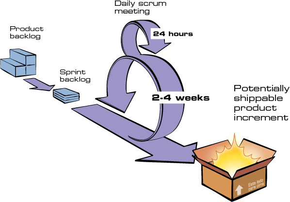

# Metodologias

  

Para atingir os objetivos de nosso projeto, e de acordo com a orientação de nossos professores, utilizamos metodologias ágil, utilizamos o Scrum no nosso planejamento do ciclo de vida do nosso projeto, e na divisão de tarefas de cada integrante, e utilizamos também o XP com a programação em pares(Pair Programming).

  
  

## Scrum

  

Scrum é uma metodologia ágil para gestão e planejamento de projetos de software.

No Scrum, os projetos são divididos em ciclos (tipicamente mensais) chamados de Sprints. O Sprint representa um Time Box dentro do qual um conjunto de atividades deve ser executado. Metodologias ágeis de desenvolvimento de software são iterativas, ou seja, o trabalho é dividido em iterações, que são chamadas de Sprints no caso do Scrum.

  

## Divisão dos “Roles”(Tarefas) do Scrum:

	
	 
	

  

### Product Owner

  

O Product Owner é o dono do produto, é quem define os itens que compõem o Product Backlog e os prioriza nas Sprint Planning Meetings, pois fornece o conhecimento do negócio em forma de requisitos para a equipe assim como sua ordem de aplicação. Na prática, o Product Owner é a interface entre a empresa e os clientes.

  

O Product Owner Trabalha em conjunto com a equipe definindo as necessidades dos usuários, os requisitos técnicos, documentando-os conforme a necessidade, e determinando a ordem de sua execução. Ele gerencia o Product Backlog (que é o repositório de todas essas informações), mantendo-o ao nível de detalhe e qualidade que a equipe necessita.

  

O Product Owner também define o cronograma para liberação das releases, e faz a validação final para saber se as implementações têm as características e qualidade necessárias para a liberação.

  

### Scrum Master

  

O Scrum Master tem a responsabilidade de assegurar que a equipe respeite e siga os valores e as práticas do Scrum. Ele também protege a equipe assegurando que ela não se comprometa excessivamente com relação àquilo que é capaz de realizar durante um Sprint.

  

As responsabilidades do Scrum Master incluem:

  

* Remover as barreiras entre a equipe e o Product Owner.

  

* O Scrum Master atua como facilitador do Daily Scrum e torna-se responsável por remover quaisquer obstáculos que sejam

levantados pela equipe durante essas reuniões.

* Melhorar a produtividade da equipe da forma que for possível.

* Melhorar as práticas de engenharia e ferramentas para que cada incremento de funcionalidades seja potencialmente entregável.

* Manter as informações sobre o progresso da equipe visível a todos de uma forma clara e organizada.

  
  

Em termos práticos, o Scrum Master precisa ter em mente a vivência do Scrum para treinar e orientar os outros papéis, e educar e ajudar as outras partes interessadas que estão envolvidas no processo.

  

### Scrum Team

  

O Scrum Team é a equipe de desenvolvimento sem a necessidade de uma divisão funcional através de papéis tradicionais, tais como programador, designer, analista de testes ou arquiteto. Todos no projeto trabalham juntos para completar o conjunto de trabalho com o qual se comprometeram conjuntamente para um Sprint.

  

O Scrum Team é auto organizável, ou seja, quem decide quem faz o que, quais as funções de cada membro e o que cabe ou não na Sprint é o time.

  

Cada Scrum Team trabalha normalmente, mas cada equipe também contribui com uma pessoa que deverá frequentar o Scrum of Scrums Meeting para coordenar o trabalho de múltiplas equipes Scrum. Esses encontros são análogos aos Daily Scrums, mas não acontecem necessariamente todos os dias. Fazer essa reunião duas ou três vezes por semana tende a ser suficiente na maioria das organizações.

  
  

| Tarefa | Integrante |

|---------------|-------------------------------------------------------|

| Scrum Master | - Eliseu Kadesh |

| Product Owner | - Gabriel Paiva |

| Developers  | - Murilo Gomes - Washington Bispo - Thiago Guilherme |

| DevOps | - Victor Yukio/Murilo Gomes |

  
  

## Sprints

  

Como visto anteriormente, as Sprints são interações do Ciclo de vida do projeto, e são tipicamente mensais, porém para adaptar a metodologia à realidade do nosso projeto, nossas Sprints são semanais.

	
	 
	

  
## Roadmap

  

O [Roadmap](/docs/Roadmap.md) é um mapeamento ou a previsão do que será realizado em cada Sprint, e funciona como um direcionamento do que será viável, tendo analisado as possibilidades e o tempo do Ciclo de vida do projeto.

  
  

## Sprint Planning Meeting (Abertura da Sprint)

  

No início de cada Sprint, faz-se um Sprint Planning Meeting, ou seja, uma reunião de planejamento na qual o Product Owner prioriza os itens do Product Backlog e a equipe seleciona as atividades que ela será capaz de implementar durante o Sprint que se inicia.

  

## Daily Scrum

  

A cada dia de uma Sprint são realizadas reuniões presenciais, ou remotas por meio do canal de comunicação Discord, em que discutimos o andamento da Sprint, trocamos informações de novas tecnologias e conhecimentos, e ouvindo a opinião de todos os integrantes sobre o desenvolvimento do projeto.

  

Para mais informações sobre as reuniões leia o nosso documento sobre a comunicação da equipe : (Link aqui).

  

## Sprint Review

  

Ao final de cada Sprint é realizada uma reunião para analisar os objetivos que foram definidos para o Backlog daquela Sprint que foram alcançados, e quais são os Débitos que serão trazidos para a próxima Sprint para que sejam resolvidos o mais rápido e da melhor forma possível.

  

Nesta reunião também analisamos a mudança no nível de conhecimento de cada integrante ao final daquela Sprint.

  

## Pair Programming

  

Para auxiliar no cumprimento dos nossos objetivos, utilizamos uma prática da metodologia XP, a programação em pares, que funciona da seguinte forma: Um integrante ficou com uma tarefa específica, porém ele não possui todas as habilidades e conhecimento para realizar-la, mas ele possui o conhecimento para fazer parte dela, então ele se reúne com outro integrante que possa ter o conhecimento que falta, então os dois juntos realizam a tarefa programando em par.
