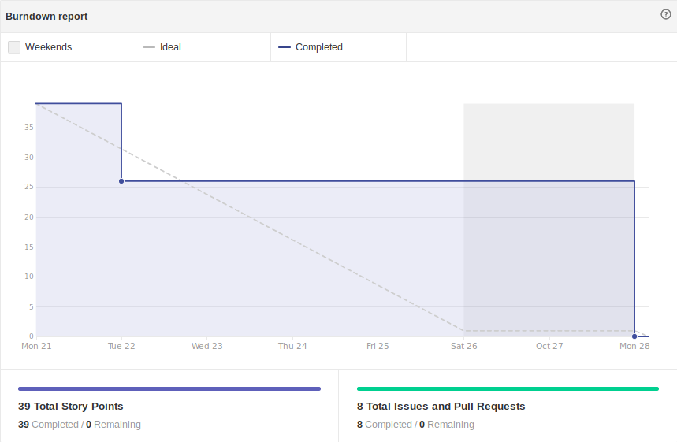

# Sprint 10

-  Início da Sprint: 21/10/2019.

-  Fim da Sprint: 28/10/2019.

## Reunião de Abertura:

- Data : 22/10/2019.

- Horário : 21:00 ás 21:30.

- Meio de comunicação: Discord.

### Resumo

Nesta reunião pontuamos alguns problemas que estamos enfrentando nesta fase do desenvolvimento, um dos principais destes problemas eram o problema com as intents, que entram em conflito com outras, por terem palavras e frases muitos similares, então colocamos este problema como prioridade, buscando ajuda com o Lappis, para conseguir algumas dicas a respeito de como escrever intents melhores. Discutimos também como poderíamos aumentar a gama de documentação que poderia ser enviada pelo bot.

## Issues e metas

- Aumentar a Gama de documentação a ser enviada pelo bot   Issues relacionadas :    [#61  Adicionar mais documentos que podem ser enviados ao usuário.](https://github.com/fga-eps-mds/2019.2-Chatbot-Nilo/issues/61).

- Melhorar e padronizar as intents :  Issues relacionadas:  
 [ #60 Padronizar o texto das intents.](https://github.com/fga-eps-mds/2019.2-Chatbot-Nilo/issues/60)
 

## Desenvolvimento

### Burndown Report

	
	 
	

## Reunião com o Monitor

 

-   Data : 24/10/2019
    
-   Horário : 20:23 ás 20:53.
    
-   Canal : Hangouts
    

 

### Resumo da reunião

Nesta reunião o monitor deu um feedback geral do que fizemos até o momento em nosso repositório, pontuando que estamos começando a utilizar melhor as Issues, também aprovou nossos prazos de fechamento de issues, que de acordo com ele estavam bons. O monitor apresentou uma série de sugestões e documentos que faltam para completar a informação na organização da equipe, metodologia utilizada e gerenciamento de prazos e métricas.

## Resultados

### Sprint Review

-   Data : 28/10/2019.
    
-   Horário : 21:00 ás 21:30
    
-   Canal : Discord.

### Resumo da reunião

 

Nesta reunião recapitulamos o andamento da Sprint, e verificamos que foi melhorado e alcançado uma melhor performance no bot, aumentamos a gama de documentação que pode ser enviada pelo bot, e recebemos um bom feedback por parte do Monitor da matéria com relação ao andamento e desenvolvimento do projeto.

#### Métas atingidas :

- Melhora na padronização das intents.
- Aumento na gama de documentação a ser enviada pelo bot.

