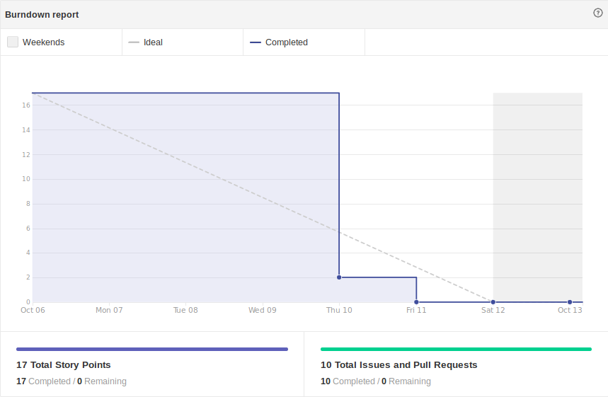

# Sprint 8

-  Início da Sprint: 06/10/2019.

-  Fim da Sprint: 13/10/2019.

## Reunião de Abertura:

-  Data: 09/10/2019.

- Horário : 20:00 às 21:30.

 - Meio de comunicação : Discord.

### Resumo da reunião

Nesta reunião foram redefinidas nossas prioridades, com base no feedback da Release 1, tendo como assunto principal a redefinição do escopo, e a organização do repositório.

## Issues e metas

- Correção do Documento de Arquitetura   Issues relacionadas :    [#27 Corrigir o Documento de Arquitetura.](https://github.com/fga-eps-mds/2019.2-Chatbot-Nilo/issues/27).

- Upgrade no README   Issues relacionadas : 
 [#28 Realizar um upgrade no README. ](https://github.com/fga-eps-mds/2019.2-Chatbot-Nilo/issues/28).

- Correção e upgrade das custom_actions   Issues relacionadas :  [#29 Melhorar as actions relacionadas ao estágio.](https://github.com/fga-eps-mds/2019.2-Chatbot-Nilo/issues/29)  [#23 Criar novas actions para facilitar o acesso aos documentos academicos.](https://github.com/fga-eps-mds/2019.2-Chatbot-Nilo/issues/23)

- Revisão do Escopo e Backlog do prodruto  Issues relacionadas :   [#30 Revisar o Escopo.](https://github.com/fga-eps-mds/2019.2-Chatbot-Nilo/issues/30)

- Colocar o repositório nos padrões da comunidade de software livre  Issues relacionadas :  [#34 Criar o Guia de contribuição do repositório.](https://github.com/fga-eps-mds/2019.2-Chatbot-Nilo/issues/34)  [#35 Criar o codigo de conduta do repositório.](https://github.com/fga-eps-mds/2019.2-Chatbot-Nilo/issues/35)
- Adicionar documentação de comunicação da equipe  [#31 Gerenciamento de comunicação.](https://github.com/fga-eps-mds/2019.2-Chatbot-Nilo/issues/31)

## Desenvolvimento

### Burndown Report

	
	 
	

## Resultados

#### Resumo dos resultados

Nesta Sprint conseguimos começar a organizar melhor nossa equipe e nosso desenvolvimento com base no feedback da Release 1. Não conseguimos finalizar o escopo definitivo, mas começamos a elabora-lo do zero, revisando a arquitetura e seus requisitos.

#### Métas atingidas :
- Adicionar documentação de comunicação da equipe
-  Colocar o repositório nos padrões da comunidade de software livre.
- Corrigir e melhorar as custom_actions.

#### Débitos anteriores resolvidos :

Não houve débito de sprints passadas.

